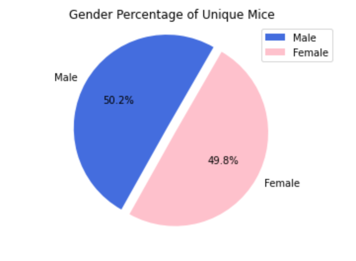
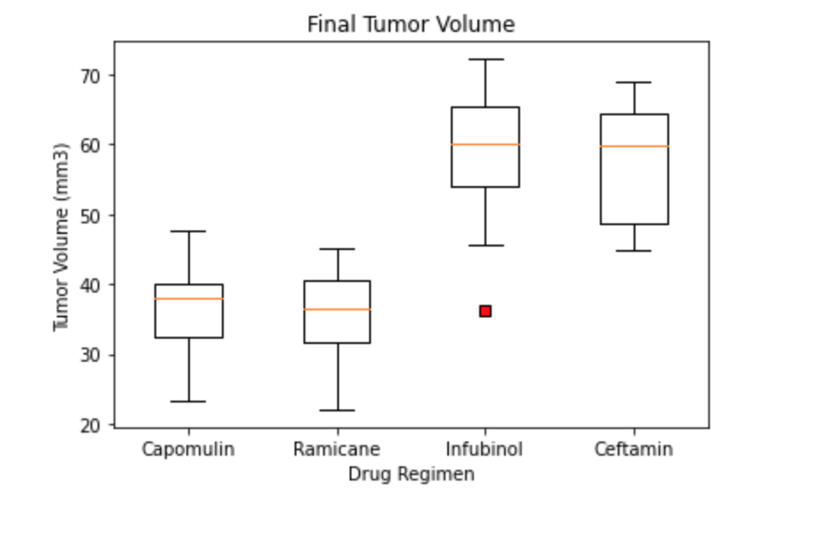
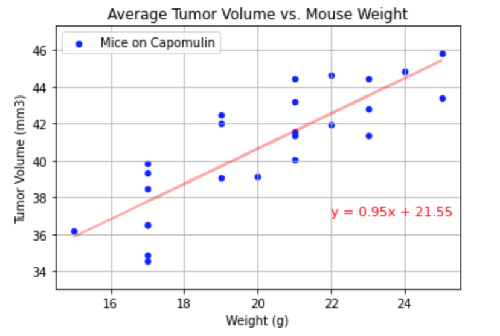

# Matplotlib-Challenge

## Table of Contents
* [Instructions](#Instructions)
* [Preview](#preview)
* [Observations](#Observations)

## Instructions

Your tasks are to do the following:

* Before beginning the analysis, check the data for any mouse ID with duplicate time points and remove any data associated with that mouse ID.

* Use the cleaned data for the remaining steps.

* Generate a summary statistics table consisting of the mean, median, variance, standard deviation, and SEM of the tumor volume for each drug regimen.

* Generate a bar plot using both Pandas's `DataFrame.plot()` and Matplotlib's `pyplot` that shows  the number of total mice for each treatment regimen throughout the course of the study.

  * **NOTE:** These plots should look identical.

* Generate a pie plot using both Pandas's `DataFrame.plot()` and Matplotlib's `pyplot` that shows the distribution of female or male mice in the study.

  * **NOTE:** These plots should look identical.

* Calculate the final tumor volume of each mouse across four of the most promising treatment regimens: Capomulin, Ramicane, Infubinol, and Ceftamin. Calculate the quartiles and IQR and quantitatively determine if there are any potential outliers across all four treatment regimens.

* Using Matplotlib, generate a box and whisker plot of the final tumor volume for all four treatment regimens and highlight any potential outliers in the plot by changing their color and style.

  **Hint**: All four box plots should be within the same figure. Use this [Matplotlib documentation page](https://matplotlib.org/gallery/pyplots/boxplot_demo_pyplot.html#sphx-glr-gallery-pyplots-boxplot-demo-pyplot-py) for help with changing the style of the outliers.

* Select a mouse that was treated with Capomulin and generate a line plot of tumor volume vs. time point for that mouse.

* Generate a scatter plot of mouse weight versus average tumor volume for the Capomulin treatment regimen.

* Calculate the correlation coefficient and linear regression model between mouse weight and average tumor volume for the Capomulin treatment. Plot the linear regression model on top of the previous scatter plot.

## Preview

## Observations
Pymaceuticals Observations :
1) The correlation coefficent for mouse weight and average tumor volume on Capomulin regimen is 0.84, indicating a strong postive correlation. As the mice weight increased the average tumor volume increased as well.
2) The study was well conducted as it used an even representation of male and female mice and tested the same amount of mice (25 mice) for each drug with the exception for Stelasyn (24 mice).
3) The Capomulin and Ramicane regimen had the lowest average tumor volumes as well as the lowest final tumor volumes, suggesting that these drug regimens work best in reducing tumor size. 

## More Info
Github: https://github.com/aspivak5

Email: aaron.spivak5@gmail.com

